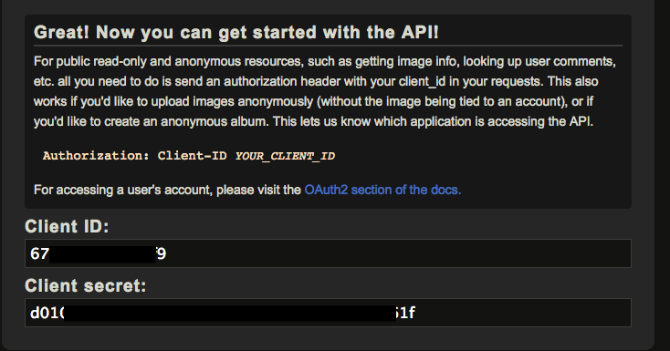
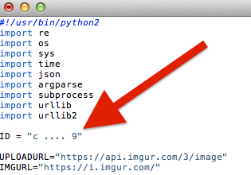

Screenshot
==========

A linux screenshot taker and imgur auto-uploader

-------

## Imgur Registration

Imgur is a platform that allows the simple sharing of images on the web.

Before you can use this Python program to automatically upload your screenshots to imgur you need to

1. Register a new user account at [https://imgur.com/register](https://imgur.com/register)
2. Register a new application at [https://api.imgur.com/oauth2/addclient](https://api.imgur.com/oauth2/addclient)
3. After successfull registration, you will receive the **Client ID** and **Client secret**

 
 

 
 
Enter this ID into the `screenshot.py` script:  
 

 
 

## Usage

`python screenshot.py -h`

<pre>
usage: screenshot.py [-h] [-i ID] [-d DELAY] [-f FILENAME] [-c] [-q] [-s] [-v]
                     [-l]

optional arguments:
  -h, --help            show this help message and exit
  -i ID, --id ID        Specify an imgur api id
  -d DELAY, --delay DELAY
                        Wait <delay> seconds before taking shot
  -f FILENAME, --filename FILENAME
                        Specify a filename (default is a timestamp)
  -c, --clean           Delete screenshot after upload (default false)
  -q, --quiet           No output except the link
  -s, --select          Select a sub area of the screen
  -v, --verbose         Display additional progress information
  -l, --clipboard       Copy imgur link to clipboard (requires xclip)
  </pre>
